# SENG-637 Assignment 3

**Topic** - Code Coverage, Adequacy Criteria and Test Case Correlation

## Table of Contents

- [Introduction](#introduction)
- [Video demo](#video-demo)
- [Manual data flow coverage](#manual-data-flow-coverage)
- [Detailed description of testing strategy for new unit tests](#detailed-description-of-testing-strategy-for-new-unit-tests)
- [Description of five selected test cases in increasing code coverage](#description-of-five-selected-test-cases-in-increasing-code-coverage)
- [Coverage screenshots of each class and method](#coverage-screenshots-of-each-class-and-method)
- [Pros and cons of coverage tools and reported metrics](#pros-and-cons-of-coverage-tools-and-reported-metrics)
- [Requirements-based test generation vs Coverage-based test generation](#requirements-based-test-generation-vs-coverage-based-test-generation)
- [Division of team work](#division-of-team-work)
- [Difficulties, challenges, and lessons learned](#difficulties-challenges-and-lessons-learned)
- [Comments and feedback](#comments-and-feedback)
- [Contributors](#contributors)

## Introduction

In this assignment, we will explore coverage tools and its involvement in software testing. We will first explore the different coverage tools that is suggested for analyzing coverage metrics, and then we will be looking at analyzing coverage manually.

Lastly, we will look at how to use the coverage tool (EclEmma) to help us improve the test cases that we have developed in Assignment 2.

## Video demo

Link to the video demonstration of coverage metrics is [here](https://www.youtube.com/watch?v=Q9oMbliU3gk).

## Manual data flow coverage

#### 1. `Range.intersects(double b0, double b1)`

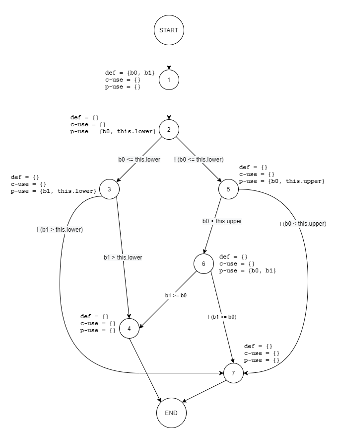

##### Defs, uses, and du-pairs

|               |                                |
| ------------- | ------------------------------ |
| **defs**:     | def(1) = {b0, b1}              |
| **uses**:     | use(2) = {b0, this.lower}      |
|               | use(3) = {b1, this.lower}      |
|               | use(5) = {b0, this.upper}      |
|               | use(6) = {b0, b1}              |
| **du-pairs**: | for b0: (1, 2), (1, 5), (1, 6) |
|               | for b1: (1, 3), (1, 6)         |

##### DU-pair coverage calculation per test case

| Variable | Def at node (n) | dcu(v, n) | dpu(v, n)                                        |
| -------- | --------------- | --------- | ------------------------------------------------ |
| b0       | 1               | {}        | {(2, 3), (2, 5), (5, 6), (5, 7), (6, 4), (6, 7)} |
| b1       | 1               | {}        | {(3, 4), (3, 7), (6, 4), (6, 7)}                 |
|          | Total           | CU = 0    | PU = 10                                          |

| Test case                      | Execution path  | DU-pairs covered       | CUc + PUc                      | All-uses coverage % |
| ------------------------------ | --------------- | ---------------------- | ------------------------------ | ------------------- |
| `intersectsWithInputBLBAndLB`  | [1, 2, 3, 7]    | (1, 2), (1, 3)         | (2, 3), (3, 7)                 | 20%                 |
| `intersectsWithInputBLBAndALB` | [1, 2, 3, 4]    | (1, 2), (1, 3)         | (2, 3), (3, 4)                 | 20%                 |
| `intersectsWithInputBLBAndAUB` | [1, 2, 3, 4]    | (1, 2), (1, 3)         | (2, 3), (3, 4)                 | 20%                 |
| `intersectsWithInputLBAndALB`  | [1, 2, 3, 4]    | (1, 2), (1, 3)         | (2, 3), (3, 4)                 | 20%                 |
| `intersectsWithInputLBAndUB`   | [1, 2, 3, 4]    | (1, 2), (1, 3)         | (2, 3), (3, 4)                 | 20%                 |
| `intersectsWithInputNOMAndNOM` | [1, 2, 5, 6, 4] | (1, 2), (1, 5), (1, 6) | (2, 5), (5, 6), (6, 4), (6, 4) | 40%                 |
| `intersectsWithInputBUBAndUB`  | [1, 2, 5, 6, 4] | (1, 2), (1, 5), (1, 6) | (2, 5), (5, 6), (6, 4), (6, 4) | 40%                 |
| `intersectsWithInputUBAndAUB`  | [1, 2, 5, 7]    | (1, 2), (1, 5)         | (2, 5), (5, 7)                 | 20%                 |
| `intersectsWithInputMINAndAUB` | [1, 2, 5, 6, 4] | (1, 2), (1, 5), (1, 6) | (2, 5), (5, 6), (6, 4), (6, 4) | 40%                 |
| `intersectsWithInputBLBAndMAX` | [1, 2, 3, 4]    | (1, 2), (1, 3)         | (2, 3), (3, 4)                 | 20%                 |
| `intersectsWithInput0And0`     | [1, 2, 5, 6, 4] | (1, 2), (1, 5), (1, 6) | (2, 5), (5, 6), (6, 4), (6, 4) | 40%                 |
| `intersectsWithInputNaNAnd1`   | [1, 2, 5, 7]    | (1, 2), (1, 5)         | (2, 5), (5, 7)                 | 20%                 |

**Total**

CUc + PUc = 8

CU + PU = 10

All-uses coverage = 80%

#### 2. `DataUtilities.calculateColumnTotal(Values2D data, int column)`

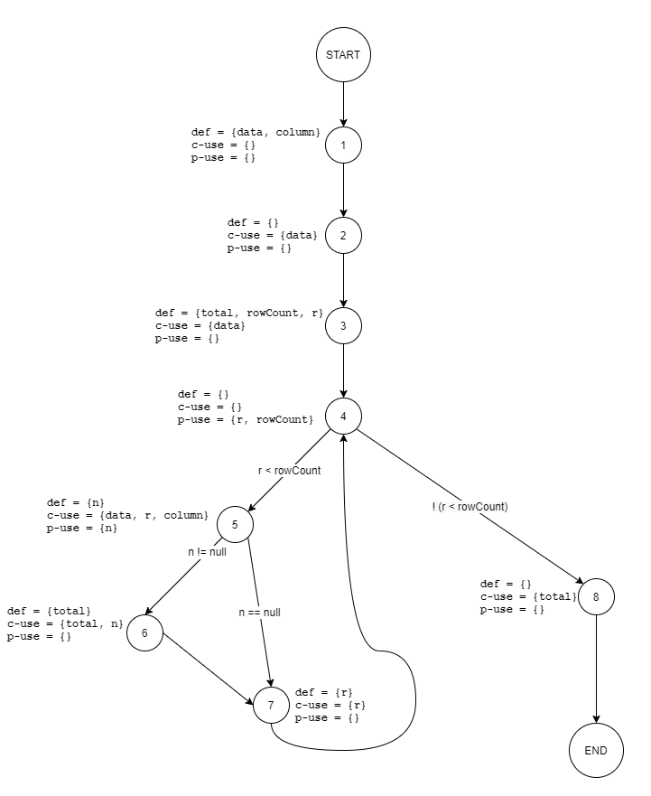

##### Defs, uses, and du-pairs

|               |                                                       |
| ------------- | ----------------------------------------------------- |
| **defs**:     | def(1) = {data, column}                               |
|               | def(3) = {total, rowCount, r}                         |
|               | def(5) = {n}                                          |
|               | def(6) = {total}                                      |
|               | def(7) = {r}                                          |
| **uses**:     | use(2) = {data}                                       |
|               | use(3) = {data}                                       |
|               | use(4) = {r, rowCount}                                |
|               | use(5) = {data, r, column, n}                         |
|               | use(6) = {total, n}                                   |
|               | use(7) = {r}                                          |
|               | use(8) = {total}                                      |
| **du-pairs**: | for data: (1, 2), (1, 3), (1, 5)                      |
|               | for column: (1, 5)                                    |
|               | for total: (3, 6), (3, 8), (6, 6), (6, 8)             |
|               | for rowCount: (3, 4)                                  |
|               | for r: (3, 4), (3, 5), (3, 7), (7, 4), (7, 5), (7, 7) |
|               | for n: (5, 5), (5, 6)                                 |

##### DU-pair coverage calculation per test case

| Variable | Def at node (n) | dcu(v, n) | dpu(v, n)        |
| -------- | --------------- | --------- | ---------------- |
| data     | 1               | {2, 3, 5} | {}               |
| column   | 1               | {5}       | {}               |
| r        | 3               | {5, 7}    | {(4, 5), (4, 8)} |
| r        | 7               | {5, 7}    | {(4, 5), (4, 8)} |
| rowCount | 3               | {}        | {(4, 5), (4, 8)} |
| total    | 3               | {6, 8}    | {}               |
| total    | 6               | {6, 8}    | {}               |
| n        | 5               | {6}       | {(5, 6), (5, 7)} |
|          | Total           | CU = 13   | PU = 8           |

| Test case                                        | Execution path                                   | DU-pairs covered                                                                                                                       | CUc + PUc                                                                                                 | All-uses coverage % |
| ------------------------------------------------ | ------------------------------------------------ | -------------------------------------------------------------------------------------------------------------------------------------- | --------------------------------------------------------------------------------------------------------- | ------------------- |
| `calculateColumnTotalAllRowsFirstColumn`         | [1, 2, 3, 4, 5, 6, 7, 4, 5, 6, 7, 4, 5, 6, 7, 8] | (1, 2), (1, 3), (1, 5), (1, 5), (3, 6), (3, 8), (6, 6), (6, 8), (3, 4), (3, 4), (3, 5), (3, 7), (7, 4), (7, 5), (7, 7), (5, 5), (5, 6) | {2,3,5}, {5}, {5, 7}, {5, 7}, {6, 8}, {6, 8}, {6}, (4, 5), (4, 8), (4, 5), (4, 8), (4, 5), (4, 8), (5, 6) | 95%                 |
| `calculateColumnTotalAllRowsMiddleColumn`        | [1, 2, 3, 4, 5, 6, 7, 4, 5, 6, 7, 4, 5, 6, 7, 8] | (1, 2), (1, 3), (1, 5), (1, 5), (3, 6), (3, 8), (6, 6), (6, 8), (3, 4), (3, 4), (3, 5), (3, 7), (7, 4), (7, 5), (7, 7), (5, 5), (5, 6) | {2,3,5}, {5}, {5, 7}, {5, 7}, {6, 8}, {6, 8}, {6}, (4, 5), (4, 8), (4, 5), (4, 8), (4, 5), (4, 8), (5, 6) | 95%                 |
| `calculateColumnTotalAllRowsLastColumn`          | [1, 2, 3, 4, 5, 6, 7, 4, 5, 6, 7, 4, 5, 6, 7, 8] | (1, 2), (1, 3), (1, 5), (1, 5), (3, 6), (3, 8), (6, 6), (6, 8), (3, 4), (3, 4), (3, 5), (3, 7), (7, 4), (7, 5), (7, 7), (5, 5), (5, 6) | {2,3,5}, {5}, {5, 7}, {5, 7}, {6, 8}, {6, 8}, {6}, (4, 5), (4, 8), (4, 5), (4, 8), (4, 5), (4, 8), (5, 6) | 95%                 |
| `calculateColumnTotalWithMaxValueAndFirstColumn` | [1, 2, 3, 4, 5, 6, 7, 4, 5, 6, 7, 4, 5, 6, 7, 8] | (1, 2), (1, 3), (1, 5), (1, 5), (3, 6), (3, 8), (6, 6), (6, 8), (3, 4), (3, 4), (3, 5), (3, 7), (7, 4), (7, 5), (7, 7), (5, 5), (5, 6) | {2,3,5}, {5}, {5, 7}, {5, 7}, {6, 8}, {6, 8}, {6}, (4, 5), (4, 8), (4, 5), (4, 8), (4, 5), (4, 8), (5, 6) | 95%                 |
| `calculateColumnTotalWithMinValueAndFirstColumn` | [1, 2, 3, 4, 5, 6, 7, 4, 5, 6, 7, 4, 5, 6, 7, 8] | (1, 2), (1, 3), (1, 5), (1, 5), (3, 6), (3, 8), (6, 6), (6, 8), (3, 4), (3, 4), (3, 5), (3, 7), (7, 4), (7, 5), (7, 7), (5, 5), (5, 6) | {2,3,5}, {5}, {5, 7}, {5, 7}, {6, 8}, {6, 8}, {6}, (4, 5), (4, 8), (4, 5), (4, 8), (4, 5), (4, 8), (5, 6) | 95%                 |
| `calculateColumnTotalWithMaxValueColumn`         | [1, 2, 3, 4, 5, 6, 7, 4, 5, 6, 7, 4, 5, 6, 7, 8] | (1, 2), (1, 3), (1, 5), (1, 5), (3, 6), (3, 8), (6, 6), (6, 8), (3, 4), (3, 4), (3, 5), (3, 7), (7, 4), (7, 5), (7, 7), (5, 5), (5, 6) | {2,3,5}, {5}, {5, 7}, {5, 7}, {6, 8}, {6, 8}, {6}, (4, 5), (4, 8), (4, 5), (4, 8), (4, 5), (4, 8), (5, 6) | 95%                 |
| `calculateColumnTotalWithMinValueColumn`         | [1, 2, 3, 4, 5, 6, 7, 4, 5, 6, 7, 4, 5, 6, 7, 8] | (1, 2), (1, 3), (1, 5), (1, 5), (3, 6), (3, 8), (6, 6), (6, 8), (3, 4), (3, 4), (3, 5), (3, 7), (7, 4), (7, 5), (7, 7), (5, 5), (5, 6) | {2,3,5}, {5}, {5, 7}, {5, 7}, {6, 8}, {6, 8}, {6}, (4, 5), (4, 8), (4, 5), (4, 8), (4, 5), (4, 8), (5, 6) | 95%                 |
| `calculateColumnTotalWithSumOf0AndFirstColumn`   | [1, 2, 3, 4, 5, 6, 7, 4, 5, 6, 7, 4, 5, 6, 7, 8] | (1, 2), (1, 3), (1, 5), (1, 5), (3, 6), (3, 8), (6, 6), (6, 8), (3, 4), (3, 4), (3, 5), (3, 7), (7, 4), (7, 5), (7, 7), (5, 5), (5, 6) | {2,3,5}, {5}, {5, 7}, {5, 7}, {6, 8}, {6, 8}, {6}, (4, 5), (4, 8), (4, 5), (4, 8), (4, 5), (4, 8), (5, 6) | 95%                 |

**Total**

CUc + PUc = 20

CU + PU = 21

All-uses coverage = 95%

## Detailed description of testing strategy for new unit tests

We will first run the coverage tool (EclEmma) on the test cases that we developed in Assignment 2 and analyze the coverage of test cases using Lines, Branches, and Method coverage metrics.

Afterwards, if the coverage of any of the ten methods is below requirements, we will look at the source code of those methods to see which parts of the methods are not covered by existing test cases.

Then we will develop new test cases to cover all possible parts source code of each method. Finally, we will verify the coverage with existing and new test cases to ensure that the coverage metrics are above the expected requirements.

## Description of five selected test cases in increasing code coverage

#### 1. `RangeTest.intersectsWithReverse()`

Before adding test case `RangeTest.intersectsWithReverse()`, the coverage calculated using EclEmma was as mentioned in below table.

| Counter      | Coverage |
| ------------ | -------- |
| Instructions | 100.0 %  |
| Branches     | 87.5 %   |
| Lines        | 100.0 %  |
| Methods      | 100.0 %  |
| Complexity   | 80.0 %   |

Although we have reached the minimum coverage of 70% coverage for branch, we can still find ways to improve this coverage.

When we analyze our test code coverage using EclEmma, we found that following condition is only partially covered

```java
return (b0 < this.upper && b1 >= b0);
```

We have found that the branch that we did not cover is when `b0 > b1`.

To improve on the coverage, we have added the test case `RangeTest.intersectsWithReverse()` where we called the `intersects` method with the values -6, -9 respectively so that `b0` (-6) is greater than `b1` (-9).

With the addition of this test case, all metrics have coverage of 100%, as again calculated using EclEmma.

| Counter      | Coverage |
| ------------ | -------- |
| Instructions | 100.0 %  |
| Branches     | 100.0 %  |
| Lines        | 100.0 %  |
| Methods      | 100.0 %  |
| Complexity   | 100.0 %  |

#### 2. `RangeTest.expandToIncludeWithNullRange()`

Before adding test case `RangeTest.expandToIncludeWithNullRange()`, the coverage calculated using EclEmma was as mentioned in below table.

| Counter      | Coverage |
| ------------ | -------- |
| Instructions | 82.4 %   |
| Branches     | 83.3 %   |
| Lines        | 85.7 %   |
| Methods      | 100.0 %  |
| Complexity   | 75.0 %   |

The minimum requirement of 70% branch coverage was already met, however 90% line coverage was not met.

When we analyze our test code coverage using EclEmma, we found that one branch was partially covered and as a result one line in that branch was not covered

```java
if (range == null) {
  return new Range(value, value);
}
```

We have found that the branch that we did not cover is when range is `null`.

To improve on the coverage, we have added the test case `RangeTest.expandToIncludeWithNullRange()` where we called the `expandToInclude` method with the values `null`, 10 respectively so that `null` range is also tested.

With the addition of this test case, all metrics have coverage of 100%, as again calculated using EclEmma.

| Counter      | Coverage |
| ------------ | -------- |
| Instructions | 100.0 %  |
| Branches     | 100.0 %  |
| Lines        | 100.0 %  |
| Methods      | 100.0 %  |
| Complexity   | 100.0 %  |

#### 3. `RangeTest.combineIgnoringNaNWithFirstRangeNullSecondRangeNaN()`

Before adding test case `RangeTest.combineIgnoringNaNWithFirstRangeNullSecondRangeNaN()`, the coverage calculated using EclEmma was as mentioned in below table.

| Counter      | Coverage |
| ------------ | -------- |
| Instructions | 65.2 %   |
| Branches     | 35.7 %   |
| Lines        | 61.5 %   |
| Methods      | 100.0 %  |
| Complexity   | 25.0 %   |

None of the minimum requirements was met for branch coverage and statement coverage.

When we analyze our test code coverage using EclEmma, we found multiple branches and statements are missing coverage. We found that one of the condition that was missed was when first range is `null` and second range is `NaN`.

```java
if (range1 == null) {
  if (range2 != null && range2.isNaNRange()) {
    return null;
}
```

To improve on the coverage, we have added the test case `RangeTest.combineIgnoringNaNWithFirstRangeNullSecondRangeNaN()` where we called the `combineIgnoringNaN` method with the first range `null` and second range with both bounds `Double.NaN`.

With the addition of this test case, we see improvements in all coverage counters like intructions, branches, lines, and complexity, as again calculated using EclEmma.

| Counter      | Coverage |
| ------------ | -------- |
| Instructions | 80.4 %   |
| Branches     | 57.1 %   |
| Lines        | 76.9 %   |
| Methods      | 100.0 %  |
| Complexity   | 37.5 %   |

#### 4. `DataUtilitiesTest.calculateRowTotalwithNullValue()`

Before adding test case `DataUtilitiesTest.calculateRowTotalwithNullValue()`, the coverage calculated using EclEmma was as mentioned in below table.

| Counter      | Coverage |
| ------------ | -------- |
| Instructions | 100.0 %  |
| Branches     | 75.0 %   |
| Lines        | 100.0 %  |
| Methods      | 100.0 %  |
| Complexity   | 66.7 %   |

Although we have reached the minimum coverage of 70% coverage for branch, we can still find ways to improve this coverage.

When we analyze our test code coverage using EclEmma, we found that following condition is only partially covered

```java
if (n !=null) {
  ...
```

We have found that the branch that we did not cover is when n=`null`.

To improve on the coverage, we have added the test case `DataUtilitiesTest.calculateRowTotalwithNullValue()` where we called the `calculateRowTotal` method by mocking `Values2D` with one value being `null`.

With the addition of this test case, all metrics have coverage of 100%, as again calculated using EclEmma.

| Counter      | Coverage |
| ------------ | -------- |
| Instructions | 100.0 %  |
| Branches     | 100.0 %  |
| Lines        | 100.0 %  |
| Methods      | 100.0 %  |
| Complexity   | 100.0 %  |

#### 5. `DataUtilitiesTest.calculateColumnTotalwithNullValue()`

Before adding test case `DataUtilitiesTest.calculateColumnTotalwithNullValue()`, the coverage calculated using EclEmma was as mentioned in below table.

| Counter      | Coverage |
| ------------ | -------- |
| Instructions | 100.0 %  |
| Branches     | 75.0 %   |
| Lines        | 100.0 %  |
| Methods      | 100.0 %  |
| Complexity   | 66.7 %   |

Although we have reached the minimum coverage of 70% coverage for branch, we can still find ways to improve this coverage.

When we analyze our test code coverage using EclEmma, we found that following condition is only partially covered

```java
if (n !=null) {
  ...
```

We have found that the branch that we did not cover is when n=`null`.

To improve on the coverage, we have added the test case `DataUtilitiesTest.calculateColumnTotalwithNullValue()` where we called the `calculateColumnTotal` method by mocking `Values2D` with one value being `null`.

With the addition of this test case, all metrics have coverage of 100%, as again calculated using EclEmma.

| Counter      | Coverage |
| ------------ | -------- |
| Instructions | 100.0 %  |
| Branches     | 100.0 %  |
| Lines        | 100.0 %  |
| Methods      | 100.0 %  |
| Complexity   | 100.0 %  |

## Coverage screenshots of each class and method

#### 1. Coverage of `Range` class - BEFORE

- **Line coverage of `Range` class**

  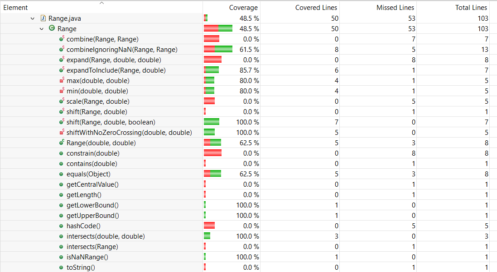

- **Branch coverage of `Range` class**

  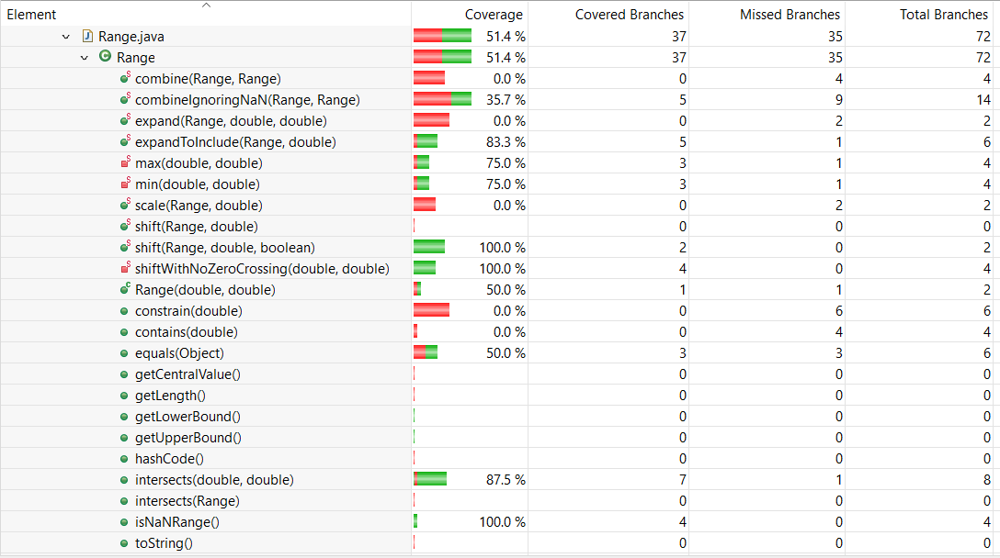

- **Method coverage of `Range` class**

  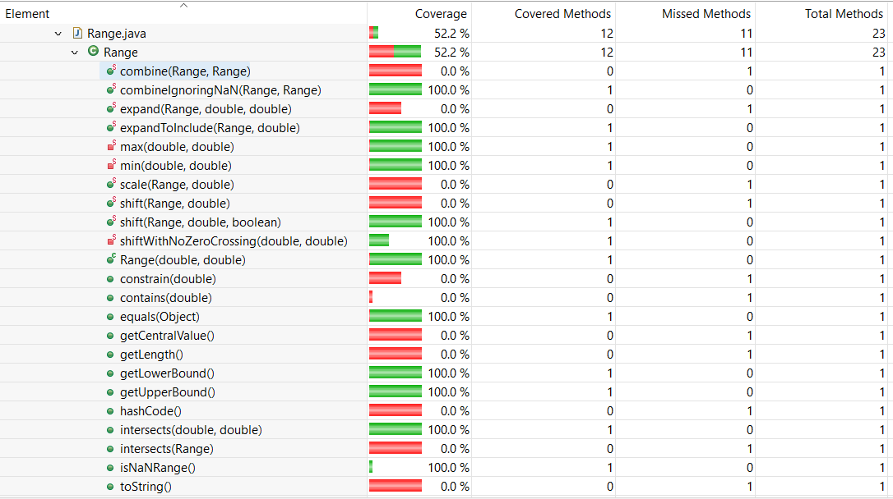

#### 2. Coverage of `Range` class - AFTER NEW TESTS

- **Line coverage of `Range` class**

  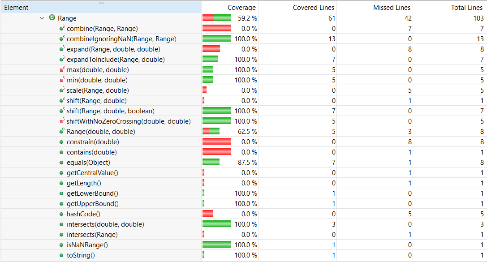

- **Branch coverage of `Range` class**

  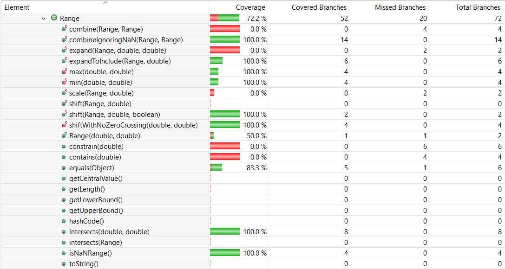

- **Method coverage of `Range` class**

  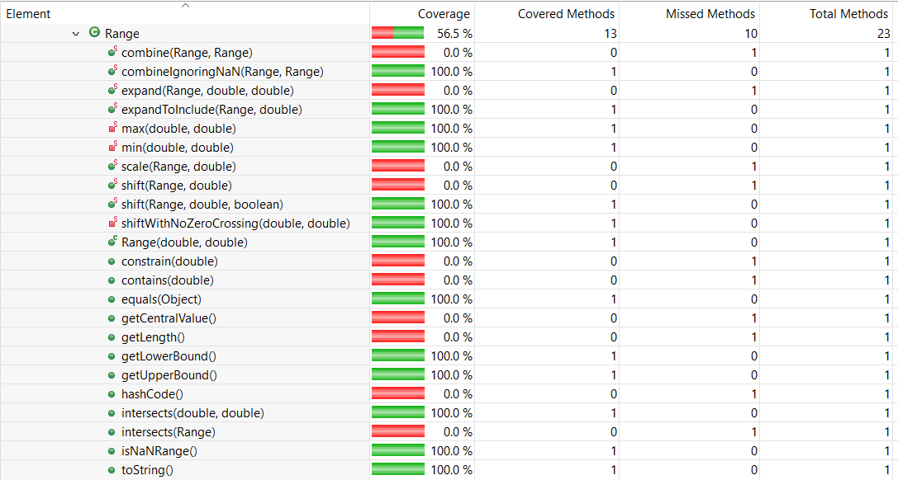

#### 3. Coverage of `DataUtilities` class - BEFORE

- **Line coverage of `DataUtilities` class**

  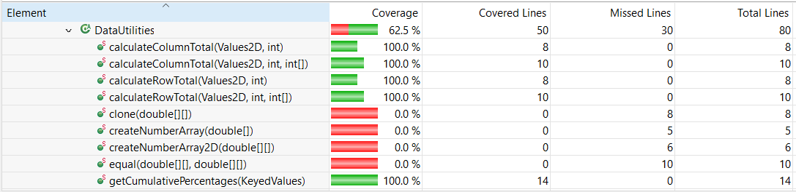

- **Branch coverage of `DataUtilities` class**

  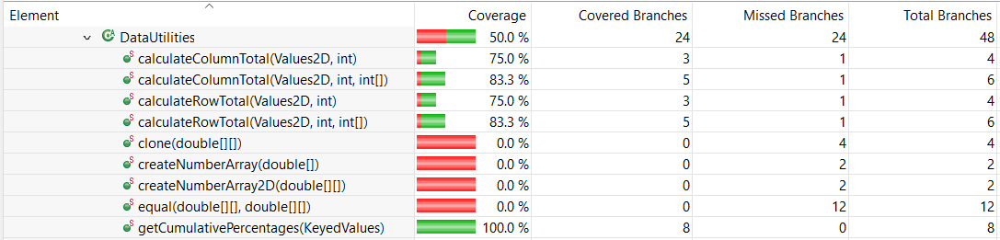

- **Method coverage of `DataUtilities` class**

  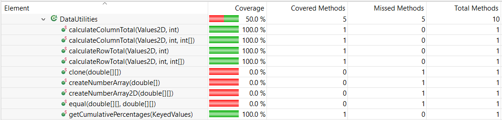

#### 4. Coverage of `DataUtilities` class - AFTER NEW TESTS

- **Line coverage of `DataUtilities` class**

  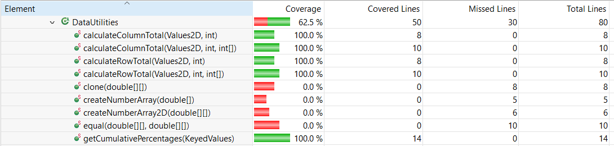

- **Branch coverage of `DataUtilities` class**

  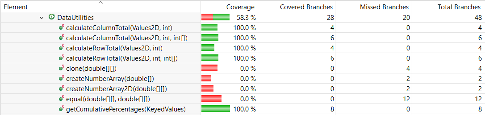

- **Method coverage of `DataUtilities` class**

  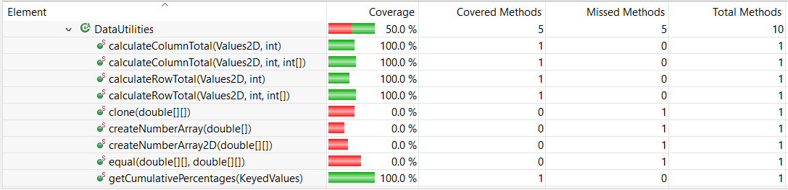

## Pros and cons of coverage tools and reported metrics

In this report, we used **EclEmma** to report the coverage metrics. EclEmma supports statement and branch coverage, but does not support condition coverage.

Other tools have been experimented but we cannot get the condition coverage to work. For example, **CodeCover** do have condition coverage, but it seems that it is discontinued from support.

When we run CodeCover on the current version of eclipse, it will produce the following error -

`Plug-in "org.codecover.eclipse" was unable to instantiate class "org.codecover.eclipse.junit.JUnitLaunchConfigurationDelegate".org/eclipse/osgi/framework/internal/core/BundleHost`

Upon researching this issue on stackoverflow, it seems that only Eclipse Kepler can be used with **CodeCover**.
We have also attempted to install Eclipse Kepler on another system to test **CodeCover**, but unfortunately we have multiple issues running the `JFreeChart` code in that version of Eclipse.

**JaCoco** has basically the same featureset as **EclEmma**, there are no differences and thus **EclEmma** is preferred.

As for **Clover**, when it transitioned to opensource by Atlassian since 2017, it seems like support and updates were dropped and requires users to compile it themselves in order to run it on their IDE. The instructions given on their website are also not detailed enough. We tried to compile **Clover** on our end but were unsuccessful.

**[Coverlipse](http://coverlipse.sourceforge.net/)** and **[Cobertura](http://cobertura.github.io/cobertura/)** had not been tested.

Thus, finally, all the tests coverage was done using **EclEmma**.

## Requirements-based test generation vs Coverage-based test generation

#### Requirements-based test generation

- **Advantages**

  - More representative of actual use cases for a user who would read Javadoc
  - Test cases are not biased by looking at the code

- **Disadvantages**

  - No way to verify test coverage
  - Planning must be more thorough to ensure all cases are tested
  - Test cases may test the same paths multiple times as testers are unsure of the source code

#### Coverage-based test generation

- **Advantages**

  - Can maximize coverage by designing test cases around the methods
  - Can verify previous black box tests
  - Can ensure test are not all testing the same cases/conditions/methods/paths

- **Disadvantages**

  - Test cases can be biased by looking at the code
  - Test cases designed only around coverage may not test all boundary cases, eg incorrect code may pass with normal values but fail at boudaries even with 100% coverage
  - Reliance on coverage tools which offer different features

## Division of team work

**Division of manual data flow coverage**

The work of producing the data flow graphs and analyzing the DU pairs was split into two parts, one group (Drew and Bhavyai) completed the `intersect` method and the other group (Michael and Oke) completed the `calculateColumnTotal` method. After the two groups finished their respective work, we reviewed each other's work.

**Division of new test cases**

Each of the four testers increased coverage of the methods according to the data in below table

| API method                                                 | Tester                                  |
| ---------------------------------------------------------- | --------------------------------------- |
| `Range.isNaNRange()`                                       | Bhavyai Gupta (already 100%)            |
| `Range.shift(Range, double, boolean)`                      | Okeoghenemarho Obuareghe (already 100%) |
| `Range.intersects(double, double)`                         | Michael Man Yin Lee                     |
| `Range.expandToInclude(Range, double)`                     | Drew Burritt                            |
| `Range.combineIgnoringNaN(Range, Range)`                   | Bhavyai Gupta                           |
| `DataUtilities.calculateRowTotal(Values2D, int)`           | Michael Man Yin Lee                     |
| `DataUtilities.calculateRowTotal(Values2D, int, int[])`    | Bhavyai Gupta                           |
| `DataUtilities.calculateColumnTotal(Values2D, int)`        | Michael Man Yin Lee                     |
| `DataUtilities.calculateColumnTotal(Values2D, int, int[])` | Drew Burritt                            |
| `DataUtilities.getCumulativePercentages(KeyedValues)`      | Okeoghenemarho Obuareghe (already 100%) |

## Difficulties, challenges, and lessons learned

Coverage is a really good tool to analyze what is missing in the test case, but as mentioned in the disadvantages, this only tests whether the test would cover all aspects of code, but does not look at the requirements itself.

We believe that, both requirements base and coverage base tests are equally important in software testing.

## Comments and feedback

1. This assignment has given us a great opportunity in learning how to make sure the test cases we write are complete and cover most of the source code effectively.

2. This assignment gave us a chance to review our assignment 2 work and see how well we did with black box testing.

3. EclEmma was used as the code coverage tool, which is already available Eclipse as an installed plugin.

4. The assignment description document [`Assignment_Description.md`](Assignment_Description.md) is very detailed and comprehensive, and it was easy to follow.

5. The Teacher Assistant has provided us very detailed and prompt feedback in clarifying any questions that we had on the assignment. For example, for the scope for section 3.3 ("Test Suite Development"), he helped us clarify that we only need to create tests to cover the required coverage metrics on the methods that we have done from assignment 2 instead of all of the methods within the Range and DataUtilities class.

## Contributors

We are group 5, and below are the team members

- [Bhavyai Gupta](https://github.com/zbhavyai)
- [Drew Burritt](https://github.com/dburritt)
- [Michael Man Yin Lee](https://github.com/mlee2021)
- [Okeoghenemarho Obuareghe](https://github.com/oobuareghe)
