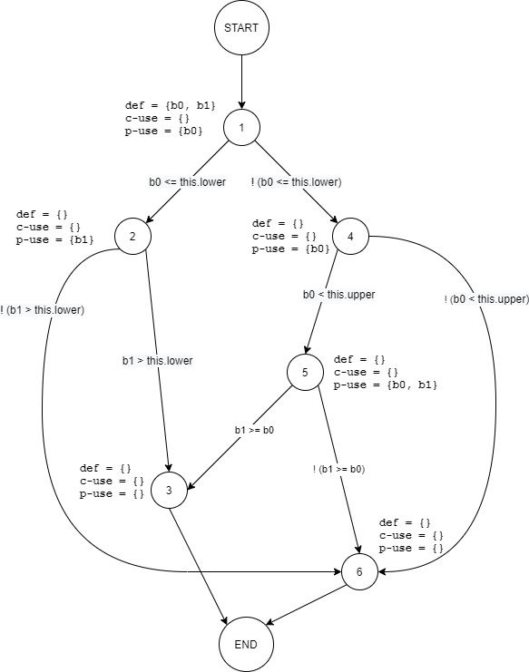
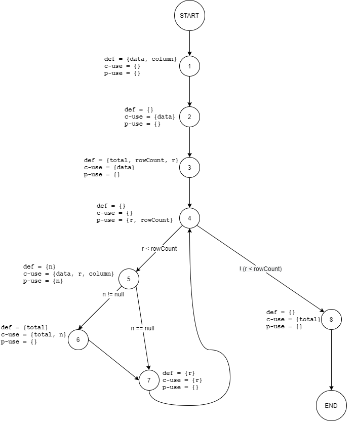
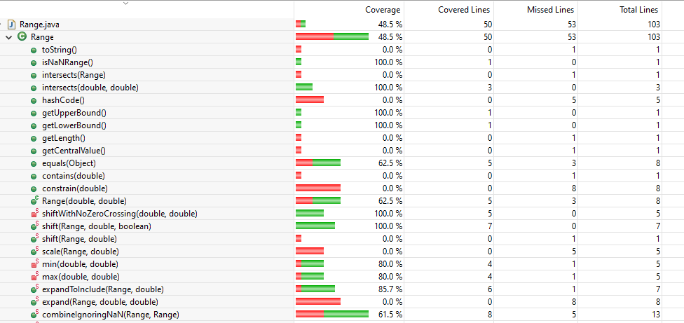
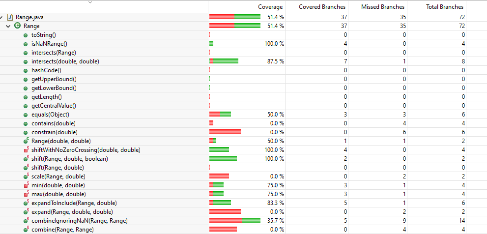
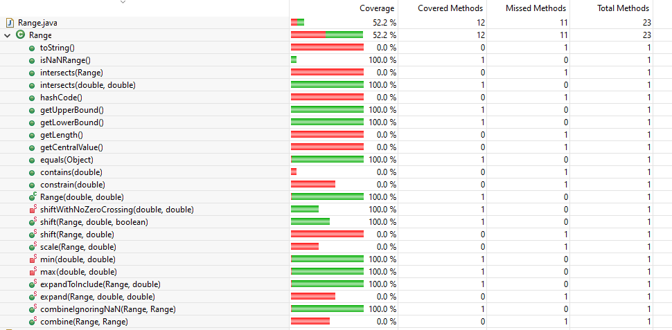
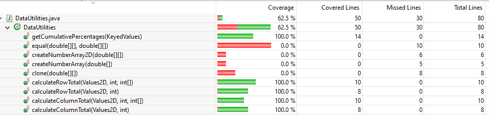
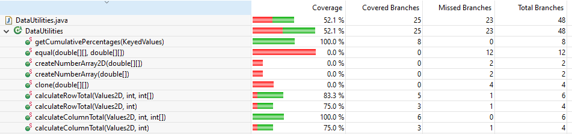
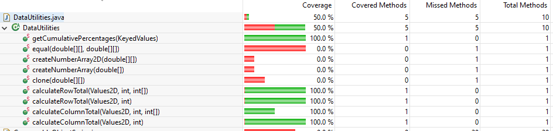

# SENG-637 Assignment 3

**Topic** - Code Coverage, Adequacy Criteria and Test Case Correlation

## Table of Contents

- [Introduction](#introduction)
- [Video demo](#video-demo)
- [Detailed description of unit test strategy](#detailed-description-of-unit-test-strategy)
- [Test cases developed](#test-cases-developed)
- [Division of team work](#division-of-team-work)
- [Difficulties, challenges, and lessons learned](#difficulties-challenges-and-lessons-learned)
- [Comments and feedback](#comments-and-feedback)
- [Contributors](#contributors)

## Introduction

Text…

## Video demo

Link to the video demonstration of testing is _TBA_.

## Manual data flow coverage

### 1. `Range.intersects(double b0, double b1)`

#### Defs, uses, and du-pairs

|               |                                |
| ------------- | ------------------------------ |
| **defs**:     | def(1) = {b0, b1}              |
| **uses**:     | use(2) = {b0, this.lower}      |
|               | use(3) = {b1, this.lower}      |
|               | use(5) = {b0, this.upper}      |
|               | use(6) = {b0, b1}              |
| **du-pairs**: | for b0: (1, 2), (1, 5), (1, 6) |
|               | for b1: (1, 3), (1, 6)         |

#### DU-pair coverage calculation per test case

| Variable | Def at node (n) | dcu(v, n) | dpu(v, n)                                        |
| -------- | --------------- | --------- | ------------------------------------------------ |
| b0       | 1               | {}        | {(2, 3), (2, 5), (5, 6), (5, 7), (6, 4), (6, 7)} |
| b1       | 1               | {}        | {(3, 4), (3, 7), (6, 4), (6, 7)}                 |
|          | Total           | CU = 0    | PU = 10                                          |

| Test case                      | DU path         | DU-pairs covered       | PUc                    | All-uses coverage % |
| ------------------------------ | --------------- | ---------------------- | ---------------------- | ------------------- |
| `intersectsWithInputBLBAndLB`  | [1, 2, 3, 7]    | (1, 2), (1, 3)         | (2, 3), (3, 7)         | 20%                 |
| `intersectsWithInputBLBAndALB` | [1, 2, 3, 4]    | (1, 2), (1, 3)         | (2, 3), (3, 4)         | 20%                 |
| `intersectsWithInputBLBAndAUB` | [1, 2, 3, 4]    | (1, 2), (1, 3)         | (2, 3), (3, 4)         | 20%                 |
| `intersectsWithInputLBAndALB`  | [1, 2, 3, 4]    | (1, 2), (1, 3)         | (2, 3), (3, 4)         | 20%                 |
| `intersectsWithInputLBAndUB`   | [1, 2, 3, 4]    | (1, 2), (1, 3)         | (2, 3), (3, 4)         | 20%                 |
| `intersectsWithInputNOMAndNOM` | [1, 2, 5, 6, 4] | (1, 2), (1, 5), (1, 6) | (2, 5), (5, 6), (6, 4) | 40%                 |
| `intersectsWithInputBUBAndUB`  | [1, 2, 5, 6, 4] | (1, 2), (1, 5), (1, 6) | (2, 5), (5, 6), (6, 4) | 40%                 |
| `intersectsWithInputUBAndAUB`  | [1, 2, 5, 7]    | (1, 2), (1, 5)         | (2, 5), (5, 7)         | 20%                 |
| `intersectsWithInputMINAndAUB` | [1, 2, 5, 6, 4] | (1, 2), (1, 5), (1, 6) | (2, 5), (5, 6), (6, 4) | 40%                 |
| `intersectsWithInputBLBAndMAX` | [1, 2, 3, 4]    | (1, 2), (1, 3)         | (2, 3), (3, 4)         | 20%                 |
| `intersectsWithInput0And0`     | [1, 2, 5, 6, 4] | (1, 2), (1, 5), (1, 6) | (2, 5), (5, 6), (6, 4) | 40%                 |
| `intersectsWithInputNaNAnd1`   | [1, 2, 5, 7]    | (1, 2), (1, 5)         | (2, 5), (5, 7)         | 20%                 |

### 2. `DataUtilities.calculateColumnTotal(Values2D data, int column, int[] validRows)`

#### Defs, uses, and du-pairs

|               |                                          |
| ------------- | ---------------------------------------- |
| **defs**:     | def(1) = {data}                          |
|               | def(1) = {column}                        |
|               | def(2) = {total}                         |
|               | def(3) = {rowCount}                      |
|               | def(4) = {r}                             |
|               | def(7) = {n}                             |
|               | def(9) = {total}                         |
|               | def(10) = {r}                            |
| **uses**:     | use(5) = {r}                             |
|               | use(5) = {rowCount}                      |
|               | use(6) = {total}                         |
|               | use(8) = {n}                             |
|               | use(9) = {n}                             |
|               | use(9) = {total}                         |
|               | use(10) = {r}                            |
| **du-pairs**: | for data: (1, 3), (1, 7)                 |
|               | for column: (1,7)                        |
|               | for total: (2, 6), (2, 9), (9,9)         |
|               | for rowCount: (3, 5)                     |
|               | for r: (4, 5), (4, 7), (4, 10), (10, 10) |
|               | for n: (7, 8), (7, 9)                    |

#### DU-pair coverage calculation per test case

| Variable | Def at node (n) | dcu(v, n) | dpu(v, n)         |
| -------- | --------------- | --------- | ----------------- |
| data     | 1               | {3, 7}    | {}                |
| column   | 1               | {7}       | {}                |
| total    | 2               | {9}       | {}                |
| total    | 9               | {9}       | {}                |
| rowCount | 3               | {}        | {(5, 6), (5, 7)}  |
| r        | 4               | {7, 10}   | {(5, 6), (5, 7)}  |
| r        | 10              | {10}      | {}                |
| n        | 7               | {9}       | {(8, 9), (8, 10)} |
|          | Total           | CU = 9    | PU = 6            |

#### DU-pair coverage in test cases

| Test case                                        | DU-pair coverage |
| ------------------------------------------------ | ---------------- |
| `calculateColumnTotalAllRowsFirstColumn`         |                  |
| `calculateColumnTotalAllRowsMiddleColumn`        |                  |
| `calculateColumnTotalAllRowsLastColumn`          |                  |
| `calculateColumnTotalWithMaxValueAndFirstColumn` |                  |
| `calculateColumnTotalWithMinValueAndFirstColumn` |                  |
| `calculateColumnTotalWithMaxValueColumn`         |                  |
| `calculateColumnTotalWithMinValueColumn`         |                  |
| `calculateColumnTotalWithSumOf0AndFirstColumn`   |                  |

## A detailed description of the testing strategy for the new unit test

Text…

## A high level description of five selected test cases you have designed using coverage information, and how they have increased code coverage

Text…

## A detailed report of the coverage achieved of each class and method (a screen shot from the code cover results in green and red color would suffice)
Range coverage Before  
  
  
  
Data Utilities coverage Before  
  
  
 

## Pros and Cons of coverage tools used and Metrics you report

Text…

## A comparison on the advantages and disadvantages of requirements-based test generation and coverage-based test generation.

Text…

## Division of team work

Text…

## Difficulties, challenges, and lessons learned

Text…

## Comments and feedback

1. This assignment has given us a great opportunity in learning how to make sure the test cases we write are complete and cover most of the source code effectively.

2. EclEmma was used as the code coverage tool, which is already available Eclipse as an installed plugin.

3. The assignment description document [`Assignment3.md`](Assignment3.md) is very detailed and comprehensive, and it was easy to follow.

## Contributors

We are group 5, and below are the team members

- [Bhavyai Gupta](https://github.com/zbhavyai)
- [Drew Burritt](https://github.com/dburritt)
- [Michael Man Yin Lee](https://github.com/mlee2021)
- [Okeoghenemarho Obuareghe](https://github.com/oobuareghe)
