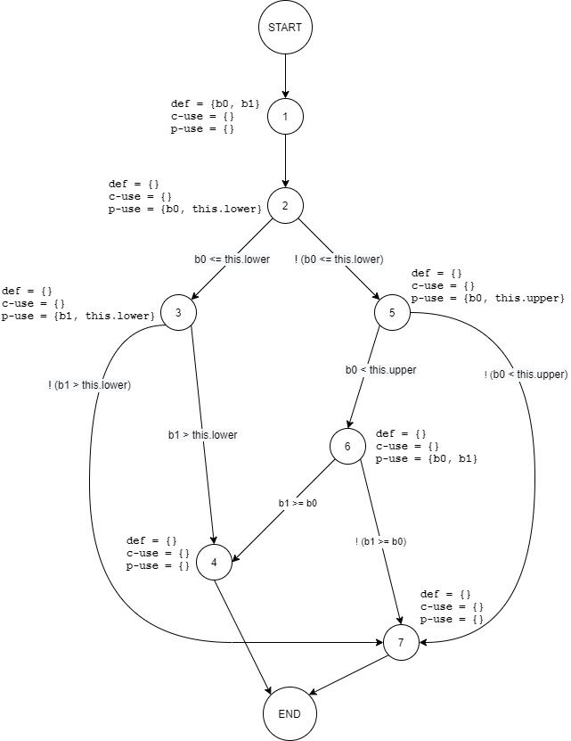
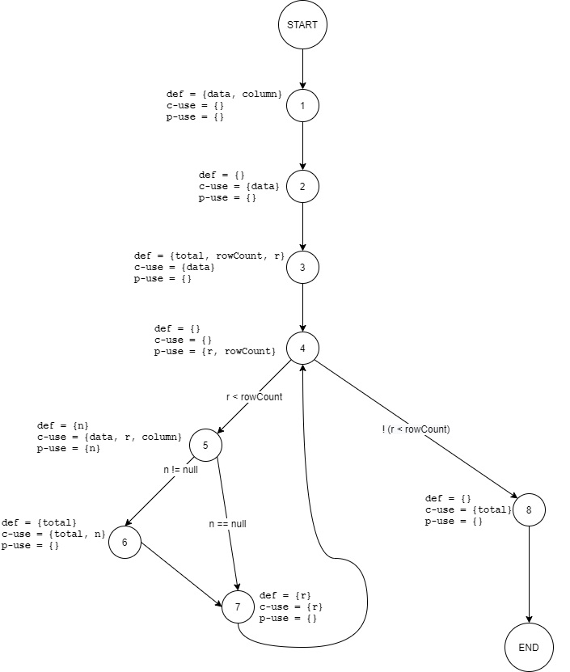

# SENG-637 Assignment 3

**Topic** - Code Coverage, Adequacy Criteria and Test Case Correlation

## Table of Contents

- [Introduction](#introduction)
- [Video demo](#video-demo)
- [Detailed description of unit test strategy](#detailed-description-of-unit-test-strategy)
- [Test cases developed](#test-cases-developed)
- [Division of team work](#division-of-team-work)
- [Difficulties, challenges, and lessons learned](#difficulties-challenges-and-lessons-learned)
- [Comments and feedback](#comments-and-feedback)
- [Contributors](#contributors)

## Introduction

In Assignment 3, Group 5 will explore coverage tools and its involvement in software testing. We will first explore the different coverage tools that is suggested for analyzing coverage metrics, and then looking at analyzing coverage manually.

Lastly, we will look at how to use the coverage tool (EclEmma) to help us improve the test cases that we have developed from assignment 2.

## Video demo

Link to the video demonstration of testing is _TBA_.

## Manual data flow coverage

### 1. `Range.intersects(double b0, double b1)`

#### Defs, uses, and du-pairs

|               |                                |
| ------------- | ------------------------------ |
| **defs**:     | def(1) = {b0, b1}              |
| **uses**:     | use(2) = {b0, this.lower}      |
|               | use(3) = {b1, this.lower}      |
|               | use(5) = {b0, this.upper}      |
|               | use(6) = {b0, b1}              |
| **du-pairs**: | for b0: (1, 2), (1, 5), (1, 6) |
|               | for b1: (1, 3), (1, 6)         |

#### DU-pair coverage calculation per test case

| Variable | Def at node (n) | dcu(v, n) | dpu(v, n)                                        |
| -------- | --------------- | --------- | ------------------------------------------------ |
| b0       | 1               | {}        | {(2, 3), (2, 5), (5, 6), (5, 7), (6, 4), (6, 7)} |
| b1       | 1               | {}        | {(3, 4), (3, 7), (6, 4), (6, 7)}                 |
|          | Total           | CU = 0    | PU = 10                                          |

| Test case                      | DU path         | DU-pairs covered       | PUc                    | All-uses coverage % |
| ------------------------------ | --------------- | ---------------------- | ---------------------- | ------------------- |
| `intersectsWithInputBLBAndLB`  | [1, 2, 3, 7]    | (1, 2), (1, 3)         | (2, 3), (3, 7)         | 20%                 |
| `intersectsWithInputBLBAndALB` | [1, 2, 3, 4]    | (1, 2), (1, 3)         | (2, 3), (3, 4)         | 20%                 |
| `intersectsWithInputBLBAndAUB` | [1, 2, 3, 4]    | (1, 2), (1, 3)         | (2, 3), (3, 4)         | 20%                 |
| `intersectsWithInputLBAndALB`  | [1, 2, 3, 4]    | (1, 2), (1, 3)         | (2, 3), (3, 4)         | 20%                 |
| `intersectsWithInputLBAndUB`   | [1, 2, 3, 4]    | (1, 2), (1, 3)         | (2, 3), (3, 4)         | 20%                 |
| `intersectsWithInputNOMAndNOM` | [1, 2, 5, 6, 4] | (1, 2), (1, 5), (1, 6) | (2, 5), (5, 6), (6, 4) | 40%                 |
| `intersectsWithInputBUBAndUB`  | [1, 2, 5, 6, 4] | (1, 2), (1, 5), (1, 6) | (2, 5), (5, 6), (6, 4) | 40%                 |
| `intersectsWithInputUBAndAUB`  | [1, 2, 5, 7]    | (1, 2), (1, 5)         | (2, 5), (5, 7)         | 20%                 |
| `intersectsWithInputMINAndAUB` | [1, 2, 5, 6, 4] | (1, 2), (1, 5), (1, 6) | (2, 5), (5, 6), (6, 4) | 40%                 |
| `intersectsWithInputBLBAndMAX` | [1, 2, 3, 4]    | (1, 2), (1, 3)         | (2, 3), (3, 4)         | 20%                 |
| `intersectsWithInput0And0`     | [1, 2, 5, 6, 4] | (1, 2), (1, 5), (1, 6) | (2, 5), (5, 6), (6, 4) | 40%                 |
| `intersectsWithInputNaNAnd1`   | [1, 2, 5, 7]    | (1, 2), (1, 5)         | (2, 5), (5, 7)         | 20%                 |

**Total**:  
PUc: (2, 3), (3, 7), (3, 4), (2, 5), (5, 6), (6, 4) (5, 7)  
All-uses coverage: 70%

### 2. `DataUtilities.calculateColumnTotal(Values2D data, int column, int[] validRows)`

#### Defs, uses, and du-pairs

|               |                                       |
| ------------- | ------------------------------------- |
| **defs**:     | def(1) = {data}                       |
|               | def(1) = {column}                     |
|               | def(3) = {r}                          |
|               | def(3) = {rowCount}                   |
|               | def(3) = {total}                      |
|               | def(5) = {n}                          |
|               | def(6) = {total}                      |
|               | def(7) = {r}                          |
| **uses**:     | use(2) = {data}                       |
|               | use(3) = {data}                       |
|               | use(4) = {r}                          |
|               | use(4) = {rowCount}                   |
|               | use(5) = {data}                       |
|               | use(5) = {r}                          |
|               | use(5) = {column}                     |
|               | use(5) = {n}                          |
|               | use(6) = {total}                      |
|               | use(6) = {n}                          |
|               | use(7) = {r}                          |
|               | use(8) = {total}                      |
| **du-pairs**: | for data: (1, 3), (1, 7), (1, 5)      |
|               | for column: (1, 5)                    |
|               | for total: (3, 6), (6, 6), (3, 8)     |
|               | for rowCount: (3, 4)                  |
|               | for r: (3, 4), (3, 5), (3, 7), (7, 7) |
|               | for n: (5, 5), (5, 6)                 |

#### DU-pair coverage calculation per test case

| Variable | Def at node (n) | dcu(v, n) | dpu(v, n)        |
| -------- | --------------- | --------- | ---------------- |
| data     | 1               | {2, 3, 5} | {}               |
| column   | 1               | {5}       | {}               |
| r        | 3               | {5, 7}    | {(4, 5), (4, 8)} |
| r        | 7               | {7}       | {}               |
| rowCount | 3               | {}        | {4}              |
| total    | 3               | {6, 8}    | {}               |
| total    | 6               | {6}       | {}               |
| n        | 3               | {6}       | {(5, 6), (5, 7)} |
|          | Total           | CU = 11   | PU = 5           |

| Test case                                        | DU path                     | DU-pairs covered                                                              | CUc+PUc                    | All-uses coverage % |
| ------------------------------------------------ | --------------------------- | ----------------------------------------------------------------------------- | ---------------------- | ------------------- |
| `calculateColumnTotalAllRowsFirstColumn`         | [1, 2, 3, 4, 5, 6, 7, 4, 8] | (1, 2), (1, 3), (3, 4), (1, 5), (3, 5), (5, 5), (6, 6), (5, 6) (7, 7), (6, 8) | (4, 5), (5, 6), (4, 8) |                     |
| `calculateColumnTotalAllRowsMiddleColumn`        | [1, 2, 3, 4, 5, 6, 7, 4, 8] | (1, 2), (1, 3), (3, 4), (1, 5), (3, 5), (5, 5), (6, 6), (5, 6) (7, 7), (6, 8) | (4, 5), (5, 6), (4, 8) |                     |
| `calculateColumnTotalAllRowsLastColumn`          | [1, 2, 3, 4, 5, 6, 7, 4, 8] | (1, 2), (1, 3), (3, 4), (1, 5), (3, 5), (5, 5), (6, 6), (5, 6) (7, 7), (6, 8) | (4, 5), (5, 6), (4, 8) |                     |
| `calculateColumnTotalWithMaxValueAndFirstColumn` | [1, 2, 3, 4, 5, 6, 7, 4, 8] | (1, 2), (1, 3), (3, 4), (1, 5), (3, 5), (5, 5), (6, 6), (5, 6) (7, 7), (6, 8) | (4, 5), (5, 6), (4, 8) |                     |
| `calculateColumnTotalWithMinValueAndFirstColumn` | [1, 2, 3, 4, 5, 6, 7, 4, 8] | (1, 2), (1, 3), (3, 4), (1, 5), (3, 5), (5, 5), (6, 6), (5, 6) (7, 7), (6, 8) | (4, 5), (5, 6), (4, 8) |                     |
| `calculateColumnTotalWithMaxValueColumn`         | [1, 2, 3, 4, 5, 6, 7, 4, 8] | (1, 2), (1, 3), (3, 4), (1, 5), (3, 5), (5, 5), (6, 6), (5, 6) (7, 7), (6, 8) | (4, 5), (5, 6), (4, 8) |                     |
| `calculateColumnTotalWithMinValueColumn`         | [1, 2, 3, 4, 5, 6, 7, 4, 8] | (1, 2), (1, 3), (3, 4), (1, 5), (3, 5), (5, 5), (6, 6), (5, 6) (7, 7), (6, 8) | (4, 5), (5, 6), (4, 8) |                     |
| `calculateColumnTotalWithSumOf0AndFirstColumn`   | [1, 2, 3, 4, 5, 6, 7, 4, 8] | (1, 2), (1, 3), (3, 4), (1, 5), (3, 5), (5, 5), (6, 6), (5, 6) (7, 7), (6, 8) | (4, 5), (5, 6), (4, 8) |                     |

## A detailed description of the testing strategy for the new unit test

With the testing strategy in this assignment, we will first run the coverage tool (EclEmma) on the test cases that we developed from assignment 2 and analyze the coverage first with respect to the Lines, Branches and Method metrics. Afterwards, we will then designed specific test cases to cover the lines,branches and/or methods that are not covered from our previous test cases developed in assignment 2.

Lastly, coverage tool will run with these new test cases to ensure that the coverage metrics are above the expected requirements.

## A high level description of five selected test cases you have designed using coverage information, and how they have increased code coverage

###Improving Coverage for intersects:

Using EclEmma, the coverage for instructions, branches, lines, and methods is:
Instructions: 100%
Branches: 87.5%
Lines: 100%
Methods: 100%
Complexity: 80%

Although we have reached the minimum coverage of 70% coverage for branch, we can still find ways to improve this coverage.

When we analyze our code using branch coverage with EclEmma, we found that one of the conditions is not covered in the following line:
return (b0 < this.upper && b1 >= b0);

We have found that the branch that we did not cover is when b0>b1.
To improve on the coverage, we have added a test case where we called the intersect method with the values -6, -9 respectively so that b0 (-6) is greater than b1 (-9).

With the addition of this test code, all metrics have coverage of 100%:
Instructions: 100%
Branches: 100%
Lines: 100%
Methods: 100%
Complexity: 80%

## A detailed report of the coverage achieved of each class and method (a screen shot from the code cover results in green and red color would suffice)

Range coverage Before  
  
  

Data Utilities coverage Before  
  
  

## Pros and Cons of coverage tools used and Metrics you report

In this report, we will be using EclEmma to report the coverage metrics. EclEmma only supports statement and branch coverage, but does not support condition coverage.
Other tools have been experimented but we cannot get the condition coverage to work. For example, CodeCover do have condition coverage, but it seems that it is discontinued from support.

When we run CodeCover on the current version of eclipse, it will produce the following error:
Plug-in "org.codecover.eclipse" was unable to instantiate class "org.codecover.eclipse.junit.JUnitLaunchConfigurationDelegate".org/eclipse/osgi/framework/internal/core/BundleHost

Upon researching this issue on stackoverflow, it seems that only Eclipse Kepler can be used with CodeCover.
We have also attempted to install Eclipse Kepler on another system to test CodeCover, but unfortunately we have multiple issues running the jfreechart code in that version of Eclipse.

JaCoco has basically the same featureset as EclEmma, there are no differences and thus EclEmma is used.
As for Clover, when it transitioned to opensource by Atlassian sinceh 2017, it seems like support and updates were dropped and requires users to compile it themselves in order to have it run on their ide. We had problems in compiling it as we get errors when trying to Clover to work for our test cases. 
Coverlipse (http://coverlipse.sourceforge.net/) and Cobertura (http://cobertura.github.io/cobertura/) had not been tested.
Thus, going forward, the tests made in this report will be using EclEmma.

## A comparison on the advantages and disadvantages of requirements-based test generation and coverage-based test generation.

### Requirements-based test generation

- Advantages
  - More representative of actual use cases for a user would read Javadoc
  - Test cases are not biased by looking at the code
- Disadvantages
  - No way to verify test coverage
  - Planning must be more thorough to ensure all cases are tested
  - Test cases may test the same paths multiple times as testers are unsure of the code

### Coverage-based test generation

- Advantages
  - Can maximize coverage by designing test cases around the methods
  - Can verify previous black box tests
  - Can ensure test are not all testing the same cases/methods/paths
- Disadvantages
  - Test cases can be biased by looking at the code
  - Test cases deigned only around coverage may not test all boundary cases, ex: incorrect code may pass with normal values but fail at boudaries even with 100% coverage
  - Reliance on coverage tools which offer different features.

## Division of team work

### 3.2 Manual data flow coverage

We first split the work of producing the flow graph and analyzing the DU pairs into two parts, one group (Drew and Bhavyai) is looking at the intersect method and the other group (Michael and Oke) is doing the calculateColumn total method. After the two groups finish the work, the two groups will then review each others work to see if there are any issues.

### 3.3 TEST SUITE DEVELOPMENT

Each of the four testers will increase coverage of the following methods.

| API method                                                 | Tester                                  |
| ---------------------------------------------------------- | --------------------------------------- |
| `Range.isNaNRange()`                                       | None (Already 100%)                     |
| `Range.shift(Range, double, boolean)`                      | Okeoghenemarho Obuareghe (Already 100%) |
| `Range.intersects(double, double)`                         | Michael Man Yin Lee                     |
| `Range.expandToInclude(Range, double)`                     | Drew Burritt                            |
| `Range.combineIgnoringNaN(Range, Range)`                   | Bhavyai Gupta                           |
| `DataUtilities.calculateRowTotal(Values2D, int)`           | Michael Man Yin Lee                     |
| `DataUtilities.calculateRowTotal(Values2D, int, int[])`    | Bhavyai Gupta                           |
| `DataUtilities.calculateColumnTotal(Values2D, int)`        | Michael Man Yin Lee                     |
| `DataUtilities.calculateColumnTotal(Values2D, int, int[])` | Drew Burritt                            |
| `DataUtilities.getCumulativePercentages(KeyedValues)`      | Okeoghenemarho Obuareghe (Already 100%) |

## Difficulties, challenges, and lessons learned

Coverage is a really good tool to analyze what is missing in the test case, but as mentioned in the disadvantages, this only test whether the test would cover all aspects of code, but does not look at the requirements itself.

We believe that, both requirements base and coverage base tests are equally important in software testing.

## Comments and feedback

1. This assignment has given us a great opportunity in learning how to make sure the test cases we write are complete and cover most of the source code effectively.

2. This assignment gave us a chance to review our assignment 2 work and see how well we did with black box testing

3. EclEmma was used as the code coverage tool, which is already available Eclipse as an installed plugin.

4. The assignment description document [`Assignment3.md`](Assignment3.md) is very detailed and comprehensive, and it was easy to follow.

## Contributors

We are group 5, and below are the team members

- [Bhavyai Gupta](https://github.com/zbhavyai)
- [Drew Burritt](https://github.com/dburritt)
- [Michael Man Yin Lee](https://github.com/mlee2021)
- [Okeoghenemarho Obuareghe](https://github.com/oobuareghe)
